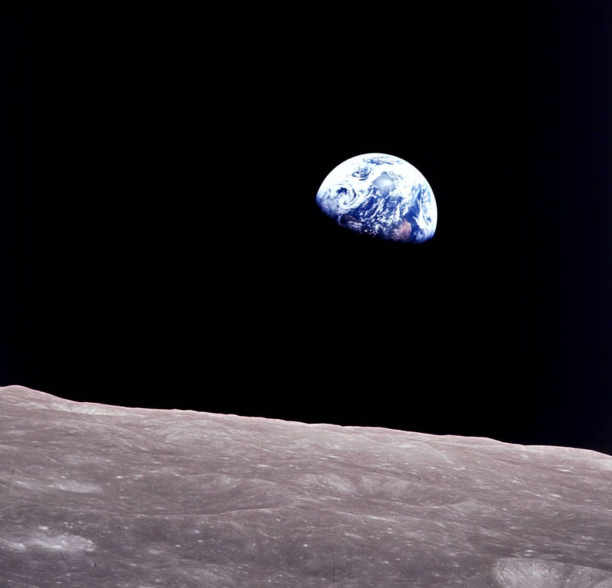

## About Me

Hello and welcome to my dairy of learning CASA0023 remotely sensing for cities and environments! My name is Entao, and I am an MSc Urban Spatial Science student at UCL. This website is a live documentation of my learning process and reflections for this module. I am very excited to learn this module as I am a huge fan of remote sensing and its applications in urban studies, especially in the context of sustainable urban development, urban resilience, and urban planning. I hope you will enjoy this journey to remote sensing!

### Background & Education

My research interests are very diverse. I have a broad interest in environmental science (climate change, biodiversity conservation, water resources management, air pollution management), urban studies(blue/green infrastrucutre, urban resilience, urban policy), remote sensing (AI implications in remote sensing, remote sensing hydrology, remote sensing for urban studies), GIS and data science. I had a Bachelor degree in Economics and Geography at University College London, and a MSc degree in Environmental Science for Sustainability at King's College London. I hope this module will help me further develop my skills in remote sensing and its applications in urban studies.

### Past Research Experiences

1.  Research: 'Do Sponge Cities Work? A Remote-Sensing Panel of Greenness and Turbitiy across Ten Chinese Cities, 2008-2024'.
2.  CourseworkResearch: 'Regional Variations in Air Quality Across Chinese Cities: Insights from Data Analysis and Predictive Modeling'.
3.  Coursework Research: 'The Role of Remote Sensing in Monitoring Flood - Assessing both Urgent and Long-term Monitoring by Using Satellite Data'.
4.  Mini-project: 'From Mining to Environmental Inequality: A Critical Global Challenge'.
5.  Coursework Research: 'TFL's Net Zero Action Plan - What is the spatial parttern of KSI casualty rates in London between 2022-2024 and how are these rates associated with local socio-economical factors?'.

### I hope to learn these things form this module:

1.  Get a better understanding of remote sensing and its applications in urban studies.
2.  Acquire better skills in processing remote sensing data from a data science perspective.
3.  Learn how to build professional website using R, quarto and relative tools.

I really hope this module can act as a foundation of my future research, and possible PhD career.

### Preface

Humans have tried to understand the Earth from the very beginning. From ancient China to renaissance Europe, people have been non-stoppingly adventuring, navigating, mapping and understanding the Earth. However, everything changed from the autumn of 1957, when the first ever artificial satellite Sputnik 1 entered its orbit. Humans have not only stared to explore the space, but most importantly, for the first time, Earth became something we could look back on: a single, blue world carring every person, every city, every river and every life we know.

::: {style="text-align: center;"}
{style="border-radius: 0%; display: block; margin-left: auto; margin-right: auto;" width="400"}

'Earthrise' by NASA, 1968.
:::

'We came all this way to explore the Moon, and the most important thing is that we discovered the Earth.'

::: {style="text-align: right;"}
— William Anders, Apollo 8 astronaut, 1968.
:::

------------------------------------------------------------------------

⬅️ Navigate to left menu and our learning journey will start from here.

↗️ View the source code from my GitHub repository.

This diary is built on Quarto.

View the source code here [GitHub](https://github.com/Entao21/rs4ct).
