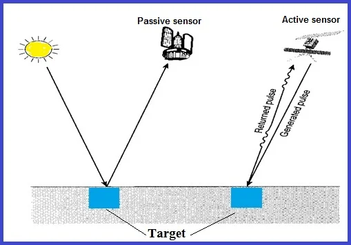
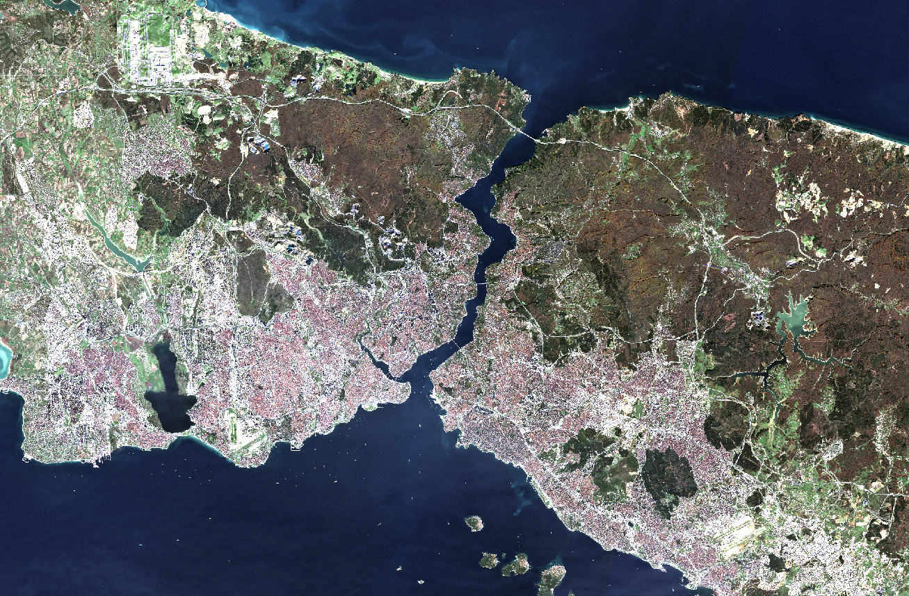
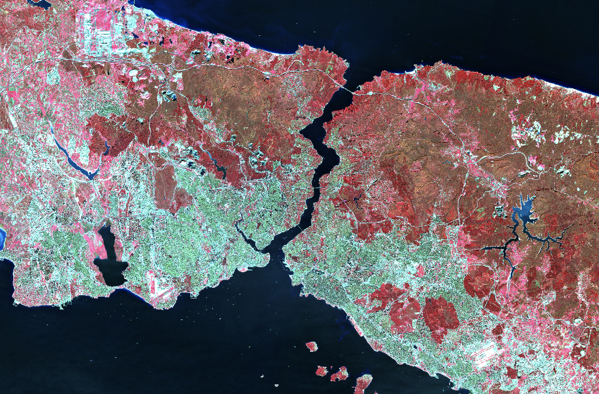
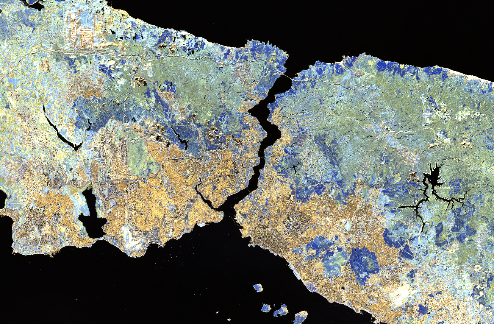
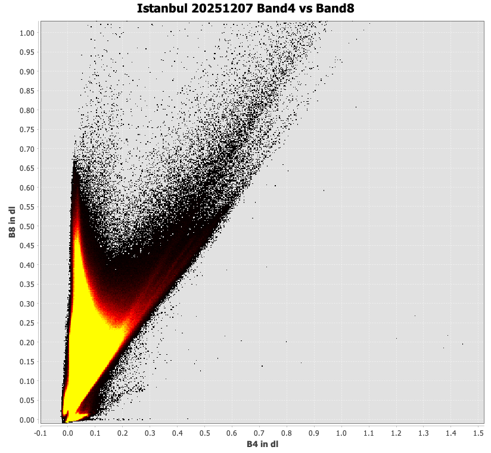
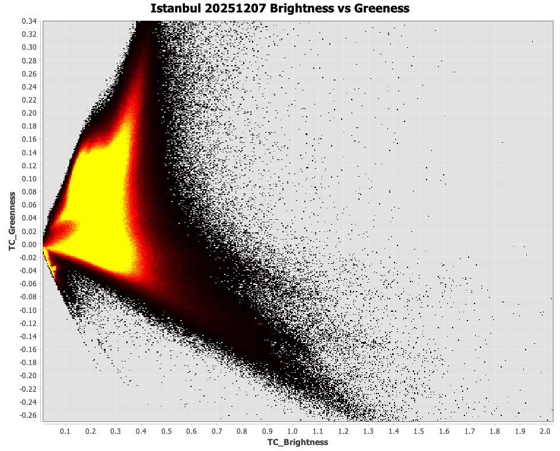

# **Summary**

Starting this module, I was truly excited that we get a chance to build our own online portfolio. I always want to do this but I just do not have a chance or opportunity to formally learn the techniques needed to build websites. For me, a portfolio works a bit like the camera rolls on my phone—it records every progress and preserves the parts of the work that I want to show later. It is also a perfect way of recording what did I do during my university time and it will become super precious in the future.

## Two Types of Sensor

Passive sensors do not emit their own energy. Instead, they detect naturally occurring energy, typically sunlight reflected off the Earth's surface or thermal radiation emitted by objects. It then records the intensity of the energy that is reflected. Famous sensors include Sentinel-2 (Launched by ESA), Landsat sensors (Launched by NASA) are all passive sensors. A weakness of these sensor is that they rely on external illumination, which can be easily blocked by atmospheric conditions like clouds, therefore they are not suitable for areas with persistent cloud cover.

Active sensors carry their own 'flashlight', they actively sends out energy and detect the energy that is reflected back. A key example is Synthetic Aperture Radar (SAR), which operates at longer wavelengths capable of penetrating clouds—a massive advantage for monitoring regions with frequent overcast weather. However, a major disadvantage of this approach is that generating their own energy requires massive amounts of power, making these sensors much more expensive to operate than passive sensors.

::: {style="text-align: center;"}
{fig-align="center"}

*Source: [GISStudy(2025)](https://gisrsstudy.com/types-of-sensor/)*
:::

## Four Types of Resolution

Remotely sensed data is fundamentally defined by four resolutions:

1.  Spatial Resolution: The physical size of the raster pixel on the ground (e.g., Sentinel-2 is 10m, while Landsat is typically 30m). It determines how much detail we can see.

2.  Spectral Resolution: The number of bands recorded across the electromagnetic spectrum. It determines the range of wavelengths that the sensor can detect.

3.  Temporal Resolution: The revisit time of the satellite (e.g., Landsat collects data every 16 days). It determines how often the sensor can capture the same area.

4.  Radiometric Resolution: The sensor's sensitivity to small differences in electromagnetic energy, defined by its bit depth (e.g., 8-bit has 256 possible values). It determines the accuracy of the sensor.

## How Electromagnetic Waves Interact with Different Surfaces

Before energy reaches a sensor, it interacts with the Earth and atmosphere through absorption, transmission, and scattering. For instance, Rayleigh scattering scatters shorter (blue) wavelengths more easily, explaining why the sky appears blue and why atmospheric correction is often necessary. In the practical, we used R and SNAP to extract pixel values and compare spectral signatures across different land covers. We also explored the Tasseled Cap transformation, which compresses bands into Brightness (bare soil/built surfaces), Greenness (vegetation), and Wetness (moisture).

# **Applications**

In this week practical, we used the Landsat 8 and Sentinel-2 data to extract spectral signatures from different land covers.

My study area of this practical is Istanbul, Turkey, which is a city with a lot of built surfaces and vegetation, and open water bodies. We downloaded data from Copernicus and EarthExplorer, and then used QGIS and SNAP to explore the data.

At first, I was following the practical instructions to filter out the image with 0% of cloud coverage, however, I found there are no image with 0% of cloud in 2025 for Istanbul. Therefore, I increased the cloud coverage to 10% and I selected December 17th, 2025 as acquisition date.

The first group of output from this week's practical is the different color composite graph. True color composite is composed of Sentinel-2 Band 2 (Blue), Band 3 (Green) and Band 4 (Red). Second graph below is the false color composite composed of B8 (NIR), B4 (Red) and B3 (Green). This could show the level of health of the vegetation. The third graph below is the atmospheric penetration composite composed of B12(SWIR), B11(SWIR) and B8A(NIR). This could highlight the vegetation in blue and urban area as gray, cyan or purple.

::: {layout-ncol="3" layout-align="center" style="text-align: center;"}
{fig-align="center"}

{fig-align="center"}

{fig-align="center"}
:::

To me, this demonstrates the true power of remote sensing, and we can easily monitor specific land covers simply by isolating their unique spectral signatures across the most relevant bands.

Second output of this week's practical is the tasseled cap. The tasseled cap is a transformation that compresses bands into Brightness (overall reflectance), Greenness (vegetation), and Wetness (moisture). This could help us to understand the level of health of the vegetation, the moisture of the soil and urban area.

The equation of tasseled cap is as follows:

$$
\begin{aligned}
\text{Brightness} &= 0.3037 \times B2 + 0.2793 \times B3 + 0.4743 \times B4 \\
  &\quad + 0.5585 \times B8 + 0.5082 \times B11 + 0.1863 \times B12 \\[0.5em]
\text{Greenness} &= -0.2848 \times B2 - 0.2435 \times B3 - 0.5436 \times B4 \\
  &\quad + 0.7243 \times B8 + 0.0840 \times B11 - 0.1800 \times B12 \\[0.5em]
\text{Wetness} &= 0.1509 \times B2 + 0.1973 \times B3 + 0.3279 \times B4 \\
  &\quad + 0.3406 \times B8 - 0.7112 \times B11 - 0.4572 \times B12
\end{aligned}
$$

Below scatterplots illustrate Istanbul’s spectral feature space before and after the Tasseled Cap transformation. The first plot maps the Red (Band 4) against the Near-Infrared (Band 8) band. Its triangular distribution reveals a rigid 'soil line' at the bottom connecting dry and wet soils, while the top-left peak highlights dense vegetation. The second plot displays the Tasseled Cap output, mapping Brightness against Greenness to reduce data dimensionality. This forms a distinct 'wizard's hat' shape, where the x-axis (Brightness) isolates highly reflective man-made urban surfaces and the y-axis (Greenness) captures vegetation. Together, these visualizations perfectly demonstrate how mathematical transformations simplify complex raw satellite bands into identifiable physical features like urban infrastructure and green spaces.

::: {layout-ncol="2" layout-align="center" style="text-align: center;"}
{fig-align="center"}

{fig-align="center"}
:::

### Applications Beyond the Practical

The Tasseled Cap Transformation (TCT) remains crucial in urban remote sensing because it efficiently compresses high-dimensional satellite data into directly interpretable physical parameters: Brightness, Greenness, and Wetness (Nedkov, 2017). For example, one of the application integrates high-resolution Sentinel-2 TCT components with machine learning algorithms to accurately map urban green infrastructure and monitor urban sprawl (Shi & Xu, 2019). However, there are opposing voices regarding its rigidity. Critics argue that TCT's fixed linear coefficients are strictly sensor-dependent and highly sensitive to local atmospheric variations (Baig et al., 2014). Consequently, some researchers advocate for dynamic, data-driven approaches—such as symbolic regression—over traditional TCT to improve global generalization across different ecosystems (Chrysostomou et al., 2024). Despite these limitations, the future of TCT in urban contexts is highly promising. Future applications aim to fuse TCT outputs with 3D radiative transfer models and active sensors to dynamically assess urban tree health and urban micro-climate resilience (Neophytides et al., 2024).

# **Reflection**

These datasets are actually quite familiar to me. During my previous studies, I extensively used both Sentinel-2 and Landsat data, but usually within Google Earth Engine. This practical was the first time I downloaded the raw data straight from the official websites and process them locally.

There do exist lots of technical difficulties for me to do the practical. I struggled the most with the SNAP software. Although I am very comfortable with QGIS, SNAP feels quite different. At first, I couldn't find the right tools and had a hard time just drawing polygon boxes. What is making it worse is my laptop constantly crashed when running SNAP, which severely slowed my progress. Furthermore, the size of our raw datasets are very big, resulting in painfully long processing times.

Despite these frustrations, I firmly believe that mastering these foundational skills is never a waste of time. Learning to handle raw data locally is crucial for our future work. I am genuinely looking forward to diving deeper into remote sensing and its applications in the coming weeks!

## References

Baig, M. H. A., Zhang, L., Shuai, T., & Tong, Q. (2014). Derivation of a tasselled cap transformation based on Landsat 8 at-satellite reflectance. Remote Sensing Letters, 5(5), 423-431.

Chrysostomou, C., Neophytides, S. P., Mavrovouniotis, M., & Hadjimitsis, D. G. (2024). Optimized spectral indices for global vegetation and water mapping using Sentinel-2. Scientific Reports, 14, 3867.

Nedkov, R. (2017). Orthogonal transformation of segmented images from the satellite Sentinel-2. Comptes rendus de l'Académie bulgare des Sciences, 70(5), 687-692.

Neophytides, S. P., et al. (2024). Estimation of Urban Tree Chlorophyll Content and Leaf Area Index Using Sentinel-2 Images and 3D Radiative Transfer Model Inversion. Remote Sensing, 16(20), 3867.

Shi, L., & Xu, H. (2019). Derivation of Tasseled Cap Transformation Coefficients for Sentinel-2 MSI At-Sensor Reflectance Data. IEEE Geoscience and Remote Sensing Letters, 16(9), 1504-1508.