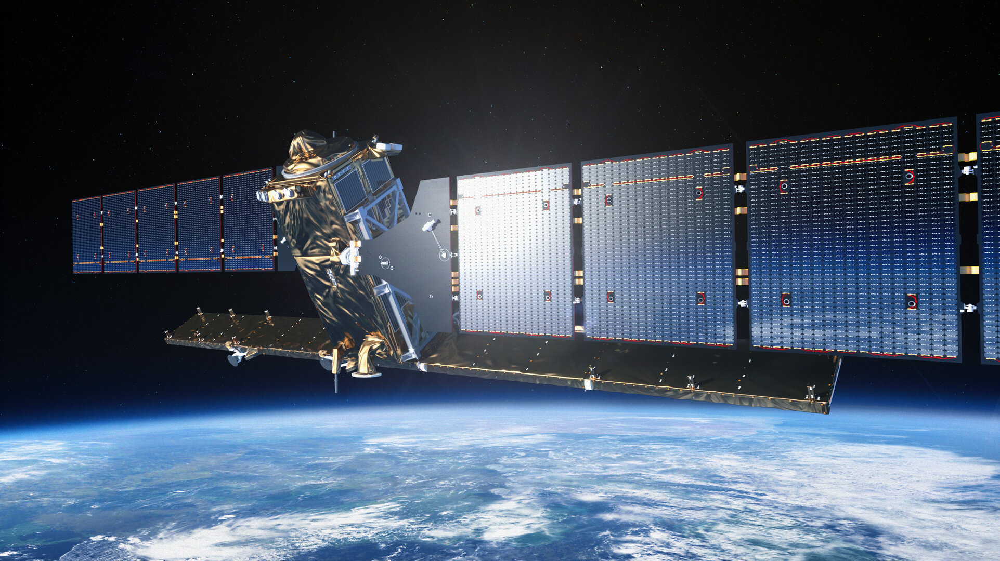

```{r xaringan-extra-panelset, echo=FALSE}
xaringanExtra::use_panelset()
```

### What is Sentinel-1?

Sentinel-1 is a pair of European Space Agency satellites in the Copernicus Programme carrying a C-band Synthetic Aperture Radar (SAR) sensor.

--

1. It is an active sensor: it transmits its own microwave signal.

--

2. It can acquire data day and night.

--

3.  It works in all weather conditions, including thick cloud cover.


```{r s1-image, echo=FALSE, out.width='62%', fig.align='center'}

```

<p style="text-align: center; font-size: 0.9em;">
  Sentinel-1. Source: <a href="https://sentiwiki.copernicus.eu/web/s1-mission" target="_blank">(ESA, 2025)</a>
</p>

---

### Sentinel-1 Technical Parameters

Sentinel-1 is technically powerful because it combines **all-weather radar imaging**, **regular revisit times**, and **open-access data**, but these same characteristics also make interpretation more demanding.

.panelset[
.panel[.panel-name[Sensor]

- **Mission:** ESA Copernicus Sentinel-1 constellation  
- **Sensor type:** C-band Synthetic Aperture Radar (SAR)  
- **Wavelength:** around 5.6 cm 
- **Sensing mode:** active microwave sensor


]

.panel[.panel-name[Resolution]

- **Spatial resolution:** commonly around 5 × 20 m in IW mode  
- **Swath width:** about 250 km  
- **Temporal resolution:** roughly 6–12 days, depending on orbit and location  
- **Radiometric sensitivity:** suitable for detecting differences in backscatter intensity  


]

.panel[.panel-name[Acquisition]

- **Main land mode:** Interferometric Wide Swath (IW)  
- **Polarisation:** commonly VV and VH  
- **Data access:** free and open-access through the Copernicus Programme  


]

.panel[.panel-name[Limitation]

- SAR images are not visually intuitive like optical imagery  
- Data usually requires calibration, speckle filtering, and terrain correction  
- Backscatter depends on surface roughness, geometry, and moisture, not colour  

]
]
---
### Sentinel -1 Pros and Cons

**Core strengths:**
--

1. Reliable acquisition in cloudy regions and during extreme weather

--

2. Sensitive to surface roughness, moisture, and structure

--

3. Particularly valuable for hazards, flooding, deformation, and infrastructure risk

--

**But it is not easy data:**

--

1. SAR imagery is not intuitively readable like true-colour optical imagery and interpretation depends on radar physics.

--

2. Images often contain speckle noise

--

3. Pre-processing is essential: calibration, filtering, and terrain correction

---

### Application in Urban Study

**Application 1 - Urban Flood Monitoring**  
- Twele et al. (2016) built a fully automated near-real-time processing chain for Sentinel-1 SAR data that ingests new images, preprocesses them, and then classifies flooded areas using auxiliary information such as topography and reference water masks. 

- The system was designed to produce flood maps without manual intervention.

--

**But?**  

--

Urban surfaces produce complex backscatter, shadows, and double-bounce effects, which can all complicate interpretation.  

--
 
Sentinel-1 is therefore powerful, but not automatically simple.

---

### Application in Urban Study

**Application 2 - Land Subsidence Monitoring**  
- Shirzaei et al. (2021) used Sentinel-1 InSAR time-series to monitor land subsidence in coastal urban regions.  

- By comparing the phase of radar waves from repeated satellite passes, they measured millimetre-scale ground deformation over time.

--

**However?**  

--

- InSAR is not straightforward to interpret, because reliable results depend on stable surface coherence across multiple observations.

--
- Vegetation, water, and rapid surface change can all reduce coherence and introduce uncertainty into subsidence mapping.

---

### Reflection: What have I learnt?

This week changed how I think about remote sensing.

Before this, I associated Earth observation mainly with satellite images that resemble photographs. Sentinel-1 showed me that remote sensing is equally about measuring the **physical properties** of the Earth's surface.

I learnt three key lessons:
- sensor choice is always a compromise
- radar data is more difficult to interpret than optical data
- difficulty does not reduce value; it often reflects greater analytical depth

For me, the most important shift was understanding that remote sensing is not only visual. It is a way of observing moisture, structure, and movement as well as colour and reflectance.

---

### My future work and broader context

In a broader context, Sentinel-1 is highly relevant to urban resilience under climate change.

In my future work, I would like to combine:
- Sentinel-1 for structural and moisture-related information
- Sentinel-2 for spectral and vegetation-related information

This combination of active and passive sensing could provide a much fuller understanding of complex urban environments than either sensor alone.

---

# References

- European Space Agency (ESA). (2025). *Sentinel-1 Mission Overview*. Available at: https://sentiwiki.copernicus.eu/web/s1-mission. 
- Shirzaei, M., Freymueller, J., Törnqvist, T. E., Gallagher, D. L., Dura, T., & Piecuch, C. G. (2021). *Measuring, modelling and projecting coastal land subsidence*. Nature Reviews Earth & Environment, 2(1), 40–58.
- Twele, A., Cao, W., Plank, S., & Martinis, S. (2016). *Sentinel-1-based flood mapping: a fully automated processing chain*. International Journal of Remote Sensing, 37(13), 2990–3004.