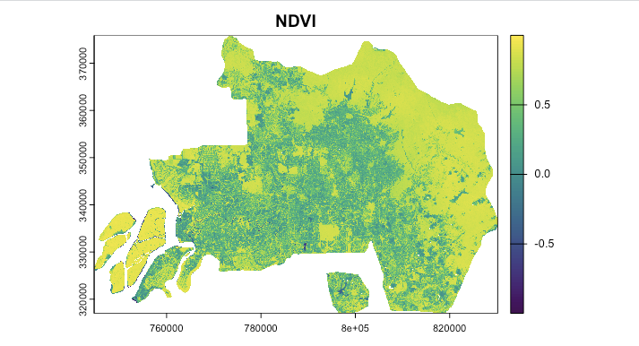
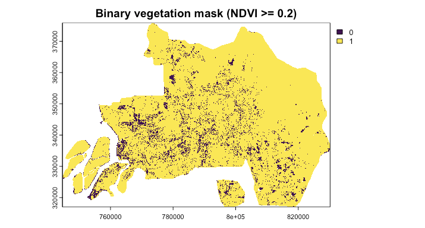
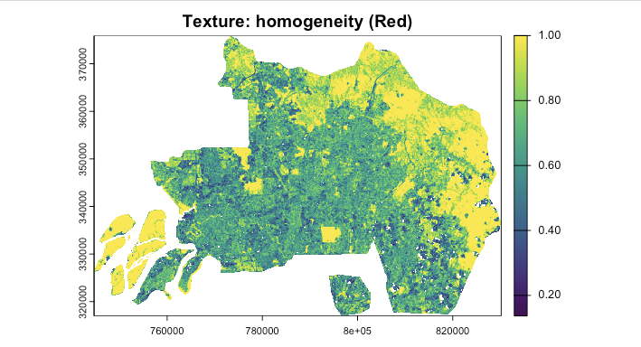
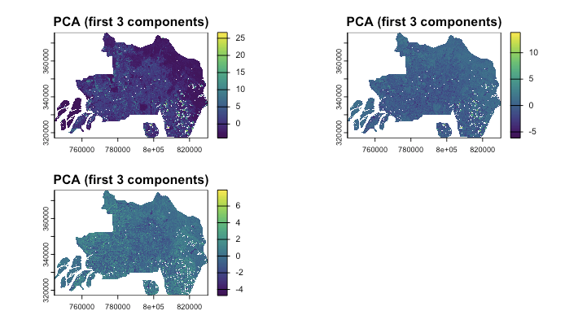

# **Summary**

Welcome to Week 3! This week felt like peeking behind the curtain of remote sensing. Previously, I naively assumed that satellite imagery was an absolute truth—a direct and perfect reflection of the ground. However, I learned that raw Digital Number (DN) values are heavily distorted by the time they reach our screens. 

## Four Types of Corrections

In this week, we were introduced to four major types of correction in remote sensing preprocessing. 

| Type of Correction | Fix What Problem | Pros | Cons | Example |
|---|---|---|---|---|
| **Geometric Correction** | Fixes spatial distortions caused by sensor viewing angle (e.g. off-nadir effects), platform instability, terrain variation, aircraft movement, and even Earth rotation, so that image features are located in their correct geographic positions. | Improves spatial accuracy and makes imagery align better with maps, vector boundaries, and other datasets. It is essential for change detection and multi-source comparison. | It requires ground control points or reference data. Also, resampling may alter original pixel values and errors can remain if the transformation model is poor. | Aligning an aerial photograph or satellite image to a base map so that roads, rivers, or buildings appear in their true locations. |
| **Atmospheric Correction** | Reduces the effects of atmospheric scattering and absorption, which can make surface reflectance appear brighter, darker, or hazier than it really is. |It makes images from different dates or places more comparable. It improves the reliability of spectral indices such as NDVI, and it helps retrieve more realistic surface properties. | Can be method-dependent and sometimes approximate. Moreover, It may not always be necessary for all tasks. Also inaccurate assumptions about the atmosphere can introduce new uncertainty. | Using Dark Object Subtraction (DOS) to remove haze from a Landsat image before analysing vegetation. |
| **Orthorectification / Topographic Correction** | Corrects distortions caused by terrain relief and uneven topography, especially in mountainous areas where slopes and elevation differences shift the apparent position or brightness of features. | Produces a more spatially realistic image. It improves positional consistency in rugged terrain. It reduces illumination differences caused by slope and aspect. | Requires DEM data and accurate sensor geometry. It can be computationally demanding and the results are dependent on terrain data's quality. | Correcting a satellite image over mountainous terrain so that hill slopes are properly positioned and not stretched or displaced. |
| **Radiometric Calibration** | Converts raw sensor measurements (e.g. Digital Numbers) into physically meaningful values such as radiance or reflectance, so the image better represents actual energy recorded from the Earth’s surface. | Makes data more scientifically interpretable. It supports quantitative comparison across sensors and dates; provides the foundation for later atmospheric correction and biophysical analysis. | Requires sensor metadata and calibration coefficients. Also, errors in calibration could affect all later analyses. | Converting Landsat Level-1 DN values into TOA radiance or reflectance before further processing. |

It is definitely useful to know these correction methods. However, in real-world analysis, we do need to consider if we actually need to apply all of these corrections. For example, Song et al. (2001) showed that atmospheric correction is not always necessary for single-date maximum-likelihood classification, and that more complicated correction methods do not necessarily improve classification or change detection performance. Correcting data too much could also introduce new errors and uncertainties. 

We should be especially careful if we are doing multi-temporal research. Hantson and Chuvieco (2011) noted that multi-temporal studies require prior geometric and radiometric homogenisation; otherwise, apparent “changes” may simply reflect misregistration or inconsistent calibration rather than real land-surface change.

# **Applications**

The practical output I want to record in this week's diary is NDVI, Texture and PCA analysis. I chose Kuala Lumpur, Malaysia as my study area, because I am always looking for cities with diverse land covers.

## NDVI

NDVI (Normalized Difference Vegetation Index) is a spectral index that is commonly used to assess the vegetation health and density. It is calculated as the ratio of the difference between the near-infrared (NIR) and red (red) bands to the sum of the NIR and red bands. As the formula shown below, since vegetation has a higher reflectance in the NIR band and a lower reflectance in the red band, a higher NDVI value indicates a higher vegetation density.
$$
NDVI = \frac{NIR - Red}{NIR + Red}
$$

{fig-align="center"}
We can easily see that the vegetation is concentrated in the outer part of the city, while the urban area is concentrated in the inner part of the city.

{fig-align="center"}
Using a threshold of NDVI ≥ 0.2, I created a binary vegetation mask. Here, 0 means NDVI < 0.2 and 1 means NDVI > 0.2. The result clearly separates areas with stronger vegetation signals from more urbanised and impervious surfaces. 

## Texture

Texture was derived from the red band using GLCM homogeneity, which measures how similar neighbouring pixel values are within a moving window. Higher values indicate more uniform surfaces, while lower values suggest greater local variation and structural complexity.

{fig-align="center"}

The texture map highlights a smoother and more continuous pattern around the urban fringe, while the city centre appears more heterogeneous. This suggests that texture captures spatial structure that is not fully visible in spectral indices such as NDVI.

## PCA

PCA was applied to the fused spectral and texture layers to reduce dimensionality and summarise the main variance in the dataset. This helps compress correlated information into fewer components for later analysis.

{fig-align="center"}

The first three components reveal broad spatial differences across Kuala Lumpur, especially between the more complex urban core and the more uniform peripheral zones. Although PCA outputs are less physically intuitive, they provide a compact representation of combined spectral and structural information.

## Applications Beyond the Practical

Modern urban remote sensing typically fuses NDVI, Texture and PCA together to map heterogeneous landscapes. For instance, Feng et al. (2015) proved that extracting GLCM texture directly from PCA components significantly improves the classification accuracy of urban vegetation compared to relying on NDVI alone. 

However, traditional data enhancements have notable limitations. Critics argue that GLCM is overly sensitive to the predefined moving-window size, which can severely blur critical urban boundaries (Kupidura, 2019). Furthermore, while PCA effectively reduces dimensionality, it statistically forces variance and can inadvertently discard subtle but vital spectral information in lower-order components. Consequently, the field is rapidly moving away from these manual feature extractions. Future urban applications are increasingly dominated by Convolutional Neural Networks (CNNs), which inherently and dynamically learn optimal spatial-spectral representations directly from raw corrected data, bypassing the need for mathematically rigid transformations like PCA or fixed-window GLCM (Zhu et al., 2017).

# **Reflection**

This week was a major reality check. My previous experience with cloud platforms like Google Earth Engine (GEE) slightly spoiled me—GEE often provides Level-2 surface reflectance products where all the atmospheric and geometric corrections are already perfectly applied behind the scenes. Having to manually code a DOS correction in R made me appreciate the immense mathematical complexity required just to get satellite data to a "usable" state.

My RStudio kept crashing when I was running the code and I kept using AI to help me with debugging. I understand the importance of computational power in nowadays' data analysis. 

I think in the future I will always bear in mind that when facing satellite data, I will always question myself first if the data needs to be corrected. 

## References

Feng, Q., Liu, J., & Gong, J. (2015). UAV remote sensing for urban vegetation mapping using random forest and texture analysis. Remote Sensing, 7(1), 1074-1094.

Kupidura, P. (2019). The comparison of different methods of texture analysis for their efficacy in land use classification in satellite imagery. Remote Sensing, 11(10), 1233.

Zhu, X. X., et al. (2017). Deep learning in remote sensing: A comprehensive review and list of resources. IEEE Geoscience and Remote Sensing Magazine, 5(4), 8-36.