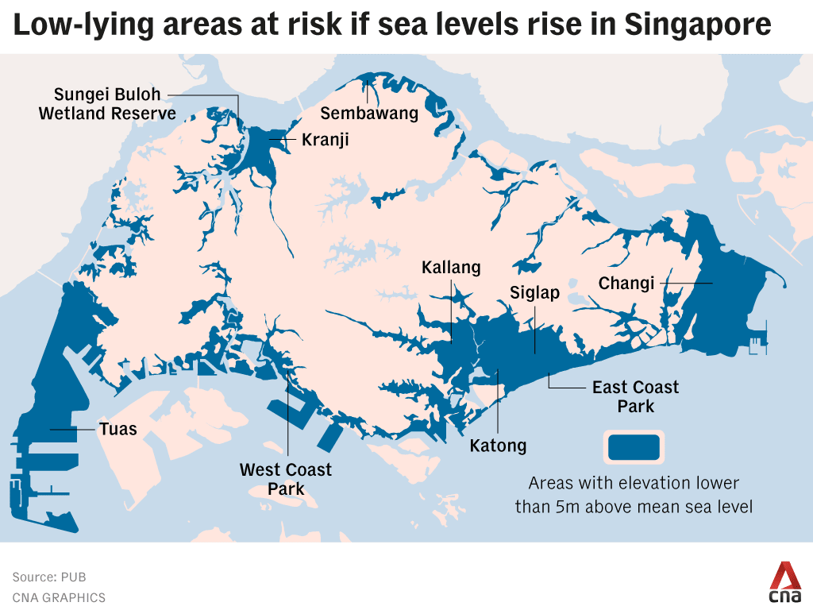
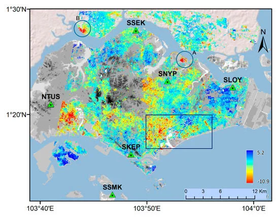

Singapore is a highly urbanised and densely populated city-state in Southeast Asia, where land is extremely limited and every planning decision involves trade-offs between development, liveability and environmental resilience. This makes Singapore a strong case for policy analysis, because land-use planning must not only accommodate housing, transport and economic growth, but also respond to rising climate risks such as urban heat and the uneven distribution of green space.

# **Summary**

My chosen policy analysis focuses on the Singapore Master Plan, specifically the theme “A Flood Resilient City & Coast”. This theme addresses a major planning challenge for Singapore: how to protect a low-lying coastal city from both **inland flooding** and **sea flooding** caused by sea-level rise while continuing to support long-term urban development.

According to the URA Draft Master Plan webpage, Singapore faces increasing flood risk under climate change. By 2100, extreme daily rainfall is projected to rise across all seasons, while relative mean sea levels around Singapore could increase by as much as 1.15 metres. When combined with storm surges and daily tidal activity, water levels could rise to between 4 and 5 metres. This is especially significant because around 30 percent of Singapore’s land area is currently less than 5 metres above mean sea level. These conditions make flood resilience not only an environmental issue, but also a central land-use and planning concern.

::: {#fig-threat fig-align="center"}

Singapore Area being Threatened by Rising Sea Level. *Source: [CNA](https://www.climateimpactstracker.com/climate-change-in-singapore/)*
:::

What makes this policy especially interesting is its integrated approach. For inland flooding, Singapore has reduced flood-prone areas from about 3,200 hectares in the 1970s to less than 25 hectares today through PUB’s source-receptor-pathway approach. For coastal flooding, the government is considering a range of measures, including sea walls, earth mounds, tidal gates and nature-based solutions. Since 2021, site-specific studies have been carried out to develop adaptation strategies for different parts of the coastline, and by 2026, studies covering over 80 percent of Singapore’s coastlines are expected to be in progress.

The “Long Island” project within this policy is a smart way of integrating city flood protection with tidal flooding protection. An dedicated area of water body is designed to be used as a buffer zone for the city (with pump station built inside). 

::: {#fig-longisland fig-align="center"}

Long Island Tidal Buffer Zone. *Source: [URA](https://www.uradraftmasterplan.gov.sg/themes/strengthening-urban-resilience/a-flood-resilient-city-and-coast/)*
:::

The policy also shows that flood protection in Singapore is closely linked to broader development goals. This also aligns strongly with UNSDG 11 (Sustainable Cities and Communities) and UNSDG 13 (Climate Action), as the policy aims to strengthen urban resilience, reduce disaster risk, and integrate long-term climate adaptation into land-use planning, infrastructure development and coastal management in a highly vulnerable urban environment.

::: {#fig-sdg fig-align="center"}

UNSDG Goals. *Source: [UN](https://sdgs.un.org/goals)*
:::

Overall, this makes Singapore’s flood resilience strategy a strong example of how climate adaptation can be embedded into long-term urban planning.

# **Applications**
InSAR datasets could support Singapore’s “Flood Resilient City & Coast” strategy by making flood risk more spatially explicit and therefore more actionable in planning. InSAR (Interferometric Synthetic Aperture Radar) is a radar-based remote sensing dataset that can detect very small changes in ground elevation over time, making it useful for identifying land subsidence and low-lying areas that may increase flood risk.

## Supporting Mitigation of Inland Flooding

For inland flooding, InSAR can help detect subtle land subsidence that may increase local flood risk in dense urban areas. This is important because even small vertical changes in ground level can alter drainage pathways and increase water accumulation during heavy rainfall. Yin et al. (2016) modelled an inland area in Shanghai and built a hydraulic model to simulate topographic change caused by subsidence. They also emphasised that this approach could be useful for other megacities with highly heterogeneous urban surfaces.

## Supporting Mitigation of Tidal Flooding

For coastal resilience, EO is especially valuable because it allows planners to monitor changing exposure over time rather than relying only on static protection standards. Satellite radar and elevation-based analysis can be used to detect land subsidence, map low-lying terrain and model future inundation under sea-level-rise scenarios. In Singapore, Catalao et al. (2020) made use of InSAR dataset and proved that estuary land subsidence can significantly increase an area's flood vulnerability, especially in reclaimed or low-flat coastal zones. This means EO can help identify where coastal protection should be prioritised, where design levels may need revision and where adaptation should be integrated with long-term development plans rather than treated as a separate engineering exercise (URA, 2025; Catalao et al., 2020).

::: {style="text-align: center;"} 
{fig-align="center"}
:::

However, EO and InSAR are not complete flood-planning solutions. They are useful for identifying changing physical exposure, such as land subsidence and low-lying terrain, but they do not directly capture drainage capacity, infrastructure condition or social vulnerability. Their value therefore lies in supporting wider hydrological and planning analysis, rather than replacing it.

# **Reflection**

This case helped me understand that the value of Earth observation in urban policy is not only technical, but also strongly strategic. Before this week, I mainly thought of remote sensing as a tool for mapping environmental conditions, such as land cover or flood-prone areas. However, the Singapore example showed me more clearly that these outputs only become meaningful when they are connected to planning decisions. In this case, EO and InSAR are useful not simply because they can produce spatial data, but because they can help identify where flood risk may intensify and where adaptation should be prioritised.

I also found this case interesting because Singapore approaches flood resilience as part of long-term urban development rather than as a purely engineering problem. At the same time, it reminded me that spatial data alone is never enough. Even detailed EO datasets cannot directly answer questions about infrastructure capacity, governance or social vulnerability, so their real value lies in supporting wider planning frameworks.

I think I should also reconsider how I write the “Applications” sections in my diary. After talking with other students and seeing past works, I realised that a learning diary should not simply be a place to present practical results, but also a space to show the connection between what we have learned, and what researchers are doing in the field. In the following weeks, I will try to make my “Applications” sections more based on literature I've found..

## References
Catalao, J., Nico, G., Hanssen, R. and Sousa, J.J. (2020) ‘InSAR maps of land subsidence and sea level scenarios to quantify the flood inundation risk in coastal cities: The case of Singapore’, Remote Sensing, 12(2), 296.

National Climate Change Secretariat (NCCS) (2026) Drainage and flood prevention. Singapore: NCCS.

PUB (2026a) Stormwater management. Singapore: PUB, Singapore’s National Water Agency.

Urban Redevelopment Authority (URA) (2025) A Flood Resilient City & Coast. Singapore: URA.

Yin, J., Yu, D., Yin, Z., Wang, J. and Xu, S. (2016) ‘Modelling the impact of land subsidence on urban pluvial flooding: A case study of Shanghai, China’, Science of the Total Environment, 544, pp. 744–753.

