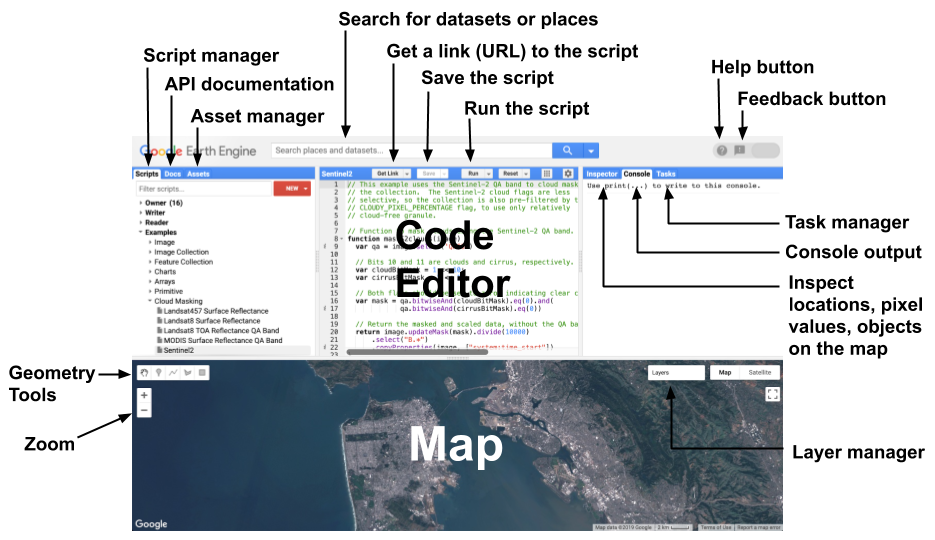
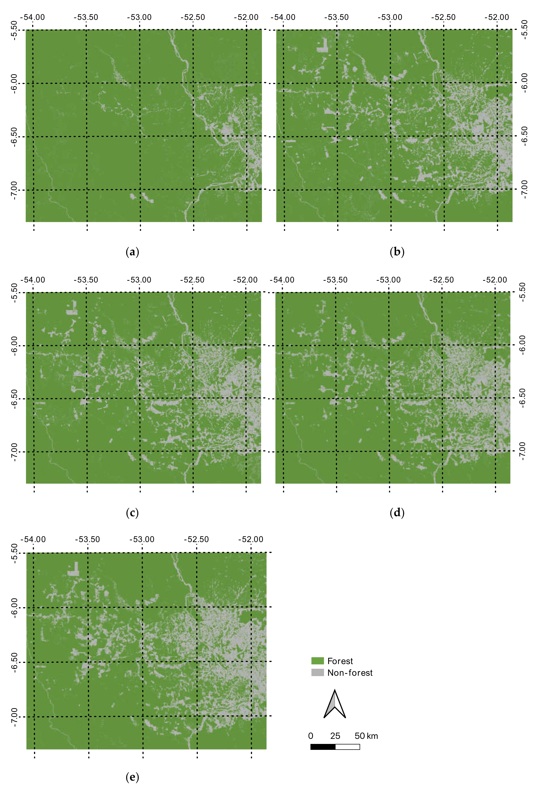
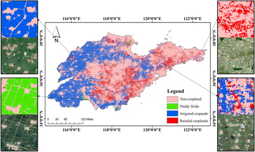

 
We were introduced to Google Earth Engine (GEE) this week. Although I had used GEE before, I did not realise that its scripting language is JavaScript. In the past, I mainly relied on remembering the syntax without fully understanding the language itself. I kind of surprised that I have learnt so much in this major, I learnt python, R, SQL, and now JavaScript. 

# **Summary**

Google Earth Engine (GEE) is an online platform operated by Google. It is a cloud-based platform with a large number of built-in geospatial and remote sensing datasets. This greatly facilitates remote sensing analysis, as users do not need to download large volumes of data to their local machines before processing them. Instead, data can be accessed, filtered and analysed directly within the platform.

::: {#fig-gee fig-align="center"}

Google Earth Engine Code Editor. *Source: [GEE(2025)](https://developers.google.com/earth-engine/guides/playground)*
:::

## Pros and Cons of GEE

Based on both my current and previous experience, I summarise the main advantages and disadvantages of using GEE as follows.

Pros: 

1. GEE makes querying data products extremely convenient. Many datasets can be loaded with just one line of code.

2. GEE does not rely heavily on local computational power, as computationally intensive tasks can be performed in the cloud.

3. GEE can also be used to build interactive web applications, making it easier to share analysis and visualisations with others.

Cons:

1. GEE has a steep learning curve for beginners, especially for those who are not familiar with JavaScript or the platform’s specific syntax and logic.

2. Although it is powerful, GEE is not always flexible for highly customised local workflows, and some analyses can be harder to debug than in Python or R run locally.

3. You have to run the code from the start, rather than being able to run a specific part of the code.

## My Thoughts on GEE, QGIS and SNAP

By using GEE, I realised that the core idea of doing research in QGIS and GEE is largely the same. Vectors and rasters are still the core data types. Many of the tasks you can do in GEE are similar to those in QGIS, such as cropping an area of interest, creating a mask, and loading raster data. Since we also learned SNAP in Week 1, I wrote the table below to compare the differences between QGIS, GEE and SNAP based on my own experience.

| Aspect | GEE | QGIS | SNAP |
|---|---|---|---|
| Core Nature | A cloud-based platform | Destop software | Desktop software|
| Main Strength | Best for handling large remote sensing datasets at scale | General GIS analysis, mapping, editing and visualisation | Processing and analysis of EO data products|
| Main Limitation | Very limited for detailed manual GIS editing and high-quality cartographic or aesthetic outputs.| Less efficient for planetary scale EO archives and repeated large-batch processing | Not suitable for general GIS/cartography and often slower for very large local workflows|
| User Interface | Mainly code based, not friendly for people who are not familiar with coding | GUI based, click and drag everything | GUI based, but requires some learning| 
| Data access | Strong built-in public data catalogue | No data, you have to download dataset | No data, have to download dataset| 
| Remote Sensing Strength | Excellent for large scale analysis | Useful for basic raster analysis, but not designed mainly for EO preprocessing | Very strong for EO preprocessing, but requires computational power|
| Cartography and Data Visualisation | Quite Limited | Excellent, QGIS feels like the 'photoshop' of GIS software | Quite Limited|

In practice, the three tools are often complementary. A common workflow is to use SNAP for EO preprocessing, GEE for large-scale analysis and time series work, and QGIS for local inspection, overlay analysis and final cartographic presentation. That division reflects each platform’s official strengths and typical design goals.

# **Applications**

After browsing the google scholar, I concluded these five examples that might be useful for my future research. 

## To detect urban land cover change
Zhang et al. (2018) used GEE to quantify short-term urban land cover change from multi-temporal Sentinel-2 imagery. GEE allowed the authors to process repeated images efficiently in the cloud and classify urban change at scale. In this case, GEE functioned as a platform for time-series image handling and urban monitoring, showing its value for tracking rapid spatial change in built environments.

## Flood detection
Johary et al. (2023) used GEE with Sentinel-1 SAR imagery to detect large-scale flood extent. The platform enabled rapid processing of radar data, which is especially useful during flood events because SAR can observe the surface even under cloud cover. Here, GEE supported an operational flood-mapping workflow, demonstrating how cloud computing can improve the speed and scalability of disaster-response analysis.

::: {#fig-sdg fig-align="center"}

Flood Detection Result from Johary et al. (2023)'s Study.
:::

## Forest change monitoring
Brovelli et al. (2020) used GEE to map and monitor forest change in the Amazon between 2000 and 2019. Their workflow involved supervised classification on cloud infrastructure, allowing repeated land cover mapping across multiple years. In this application, GEE was not only a data-access tool but also a computational environment for long-term forest monitoring, which is difficult to manage efficiently with purely local processing.

::: {#fig-sdg fig-align="center"}

Forest Change Monitoring Result from Brovelli et al. (2020)'s Study.
:::

## Cropland mapping
Xing et al. (2022) developed a semi-automatic framework in GEE to map irrigated, rainfed and paddy croplands using time-series remote sensing data. GEE helped manage large image collections and supported classification across different agricultural types. This study shows that GEE is highly useful for agricultural monitoring, especially where crop conditions vary over time and where automated workflows are needed for consistent regional analysis.

::: {#fig-sdg fig-align="center"}

Cropland Mapping Result from Xing et al. (2022)'s Study.
:::

## Land cover classification
Phan et al. (2020) used GEE and a Random Forest classifier to test different Landsat 8 compositing strategies for land cover classification. The study used GEE to compare multiple image combinations efficiently and evaluate classification outcomes. This demonstrates how GEE can support methodological experimentation as well as final mapping, making it useful not only for producing results but also for testing which remote sensing workflow performs best.

By reading these studies, I gained a clearer idea of the potential applications of GEE in my dissertation and future work. GEE seems to be a very powerful tool, especially if I want to include multi-temporal analysis. One common drawback I noticed across these papers is that they all relied on datasets already built into GEE. However, if I were to conduct urban research, I think I might need much higher-resolution data.

# **Reflection**

This week made me reflect less on GEE as a completely new tool and more on what it means for my own research development. Although GEE uses a different environment, the underlying logic of spatial analysis still feels familiar: vectors, rasters, masking, and defining areas of interest remain central. What changed is the scale and efficiency of the workflow.

For me, this is especially relevant because my interests are increasingly related to multi-temporal and policy-relevant urban research. GEE made me realise how large image archives can be analysed more systematically, which could be very useful for my future dissertation. At the same time, I also became more critical of its limitations. In urban studies, high-resolution data and local detail are often essential. Therefore, I see GEE not as a replacement for QGIS or SNAP, but as part of a broader geospatial workflow.

## References
Brovelli, M.A., Sun, Y. and Yordanov, V. (2020) ‘Monitoring forest change in the Amazon using multi-temporal remote sensing data and Google Earth Engine cloud computing’, ISPRS International Journal of Geo-Information, 9(10), p. 580. 

Johary, R., Ramli, M.F. and others (2023) ‘Detection of large-scale floods using Google Earth Engine’, Remote Sensing, 15(22), p. 5368.

Phan, T.N., Kuch, V. and Lehnert, L.W. (2020) ‘Land cover classification using Google Earth Engine and Random Forest classifier—The role of image composition’, Remote Sensing, 12(15), p. 2411.

Xing, H., Meng, J., Wang, J. and others (2022) ‘Mapping irrigated, rainfed and paddy croplands from time-series remote sensing images using Google Earth Engine’, International Journal of Digital Earth, 15(1). 

Zhang, H., Lin, H. and Wang, Y. (2018) ‘Quantifying short-term urban land cover change with time-series remote sensing images on Google Earth Engine’, Sensors, 18(12), p. 4319. 