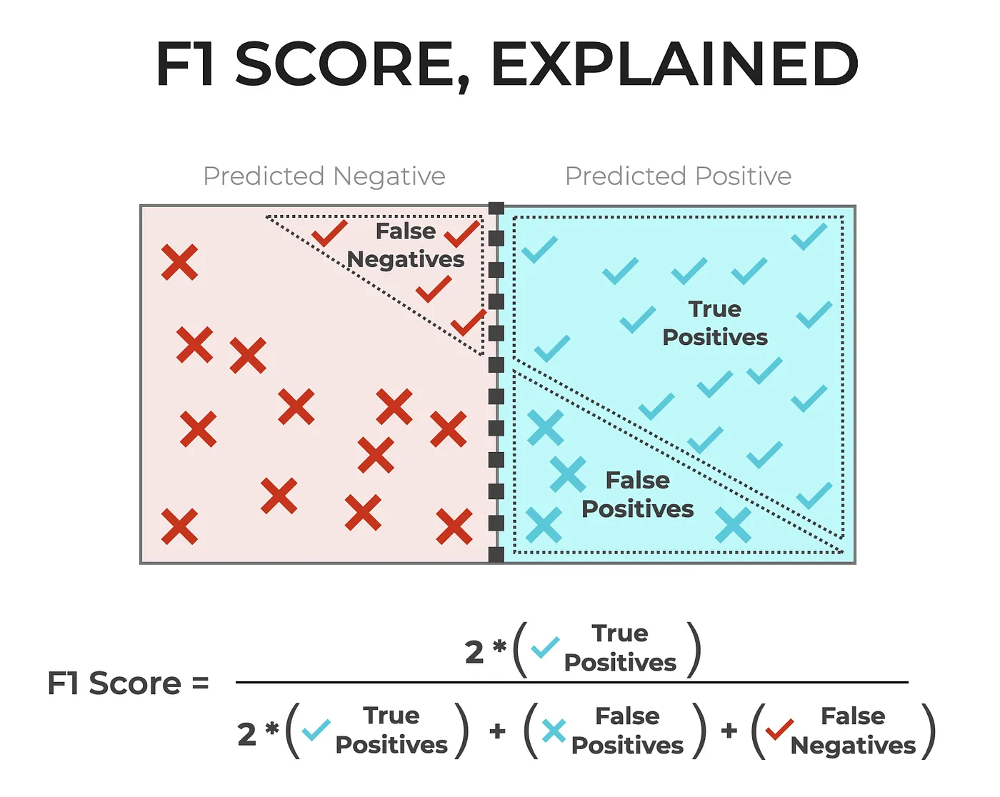
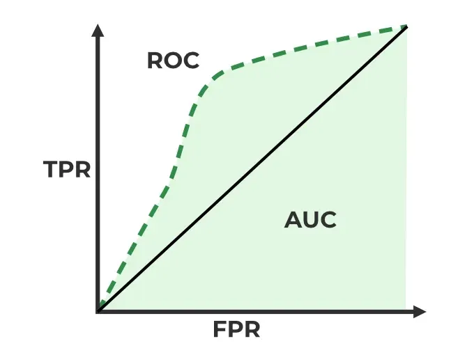

# **Summary**
This week moved beyond basic pixel-based classification and focused on more advanced ways of thinking about classification in remote sensing. A central question was whether pixels should always be treated as the main unit of analysis, especially in urban environments where land cover is often heterogeneous. 

The lecture therefore introduced object-based image analysis (OBIA), where similar pixels are grouped into larger objects before classification, and sub-pixel analysis / spectral mixture analysis (SMA), where a pixel is understood as a mixture of several land-cover types rather than a single class. In the practical, these ideas were implemented in GEE through unmix() for spectral fractions and through segmentation methods such as KMeans and SNIC for object-based workflows.

Another major focus was accuracy assessment. The lecture showed that classification is incomplete without evaluation, and introduced the error matrix, producer’s accuracy, user’s accuracy, overall accuracy, F1-score, and ROC/AUC. It also stressed that training and testing data may be spatially dependent, meaning that conventional validation can overestimate performance. For this reason, spatial cross-validation was presented as an important way to produce more realistic assessments of classification accuracy.

## Kappa 
Although Kappa adjusts for chance agreement and has been widely used in remote sensing, it should not be treated as a sufficient accuracy measure on its own. A classification may still show a reasonable Kappa value while hiding important errors in specific classes. 

## F1- Score
F1-score is a useful evaluation metric because it combines precision and recall into a single measure. This makes it particularly valuable when classification performance cannot be judged well by overall accuracy alone, especially if classes are imbalanced or if some errors matter more than others. A high F1-score indicates that the classifier is not only identifying many true positives, but also avoiding too many false positives. In this sense, F1-score provides a more balanced view of classification quality than a single overall accuracy value.

::: {#fig-sdg fig-align="center"}

You can veiw the detailed explanation of F1-score [here](https://medium.com/@nay1228/mastering-evaluation-metrics-f1-score-z-score-roc-curve-and-precision-recall-curve-cb175de25724).
:::

## ROC Curve
ROC curves and AUC are broader machine-learning style evaluation tools. Unlike simple overall accuracy, ROC-based measures assess how well a classifier separates classes across different thresholds. This makes them useful when model performance needs to be evaluated beyond a single final classification result. The lecture therefore showed that classification accuracy can be assessed in more flexible ways than only using traditional remote-sensing metrics.

::: {#fig-sdg fig-align="center"}

You can veiw the detailed explanation of ROC curve [here](https://medium.com/@nay1228/mastering-evaluation-metrics-f1-score-z-score-roc-curve-and-precision-recall-curve-cb175de25724).
:::

## Spatial Cross Validation
Normal train–test splits may overestimate model performance because of spatial autocorrelation. If training and testing samples are geographically close, they are often too similar to be truly independent. To address this, spatial cross-validation was introduced, where data are partitioned by space rather than randomly. This provides a more realistic estimate of classification accuracy, especially in remote sensing.

# **Applications**

## Object-based image analysis (OBIA)

One of the main themes of this week was that classification is not simply about assigning labels to pixels, but about deciding what the most meaningful unit of analysis should be. 

In this context, object-based image analysis (OBIA) offers an important application, especially in complex urban environments where individual pixels rarely correspond to real-world objects. Blaschke (2010) explains that OBIA works by first segmenting imagery into objects and then classifying those objects using not only spectral information, but also shape, texture and spatial context. This makes OBIA especially valuable in urban remote sensing, where buildings, roads and vegetation patches are heterogeneous and spatially structured rather than spectrally pure. For my own interests in urban and environmental research, OBIA seems particularly relevant because it links classification more closely to actual spatial units. 

A example comes from Myint et al. (2011), who compared per-pixel and object-based classification for urban land cover in Phoenix, Arizona. Using high-resolution imagery, they found that the object-based approach achieved substantially higher overall accuracy than the traditional maximum likelihood classifier. This is important because it shows that OBIA is not only conceptually attractive, but can also produce more reliable results in heterogeneous urban environments where land-cover types are spatially mixed and structurally complex.

**Cons of OBIA:**

However, OBIA is not automatically better than pixel-based methods, because its performance depends heavily on segmentation quality and parameter choice.

## Confusion matrix and accuracy assessment

However, choosing a more suitable unit of analysis does not in itself guarantee a good classification. Another major theme of this week was therefore accuracy assessment, which asks how classification results should be evaluated once they have been produced. A confusion matrix contains 4 parts: True Positive (TP), True Negative (TN), False Positive (FP) and False Negative (FN). You can derive producer’s accuracy and user’s accuracy from the confusion matrix. 

The confusion matrix remains important because it records class-by-class agreement and misclassification, rather than reducing performance to a single overall value. Foody (2002) shows that this allows more detailed measures, such as producer’s accuracy and user’s accuracy, to be derived and interpreted. This fits closely with this week's idea that classification should be assessed critically rather than accepted at face value. 

::: {#fig-sdg fig-align="center"}

You can veiw the detailed explanation of confusion matrix [here](https://www.datacamp.com/tutorial/what-is-a-confusion-matrix-in-machine-learning?dc_referrer=https%3A%2F%2Fwww.google.com%2F).
:::

**Cons of confusion matrix:**

Comber et al. (2012) argue that confusion matrices still say little about the spatial distribution of errors, meaning that a map may appear statistically acceptable while still containing geographically important inaccuracies.

# **Reflection**

This week made me think more carefully about what a “good” classification result actually means. Previously, I often focused more on the classification output itself, but this week showed me that choosing the right unit of analysis and evaluating accuracy properly are just as important. 

I found OBIA especially interesting because it seems more suitable for complex urban environments, where real-world features rarely match single pixels. This connects well with my own interests in urban remote sensing. At the same time, learning about confusion matrices and spatial cross-validation reminded me that a visually convincing map is not always a reliable one. Overall, this week helped me become more critical of both classification methods and their evaluation.

By finishing week 6 and week 7, I feel a littlle bit of overwhelmed by the amount of content I have learned. In other modules such as Huanfa's module, we were also taught with machine learning and deep learning, some of the content is overlapping with this module and some are not. Also in Ollie's module we also learned machine learning methods to detect informal settlements etc. I also had another module that is taching using CNN, GNN and transformers. I think right now it is a perfect time to review all of these content and make a summary and make everything clear.

## References

Blaschke, T. (2010) ‘Object based image analysis for remote sensing’, ISPRS Journal of Photogrammetry and Remote Sensing, 65(1), pp. 2–16.

Comber, A., Fisher, P., Brunsdon, C. and Khmag, A. (2012) ‘Spatial analysis of remote sensing image classification accuracy’, Remote Sensing of Environment, 127, pp. 237–246.

Foody, G.M. (2002) ‘Status of land cover classification accuracy assessment’, Remote Sensing of Environment, 80(1), pp. 185–201.

Myint, S.W., Gober, P., Brazel, A., Grossman-Clarke, S. and Weng, Q. (2011) ‘Per-pixel vs. object-based classification of urban land cover extraction using high spatial resolution imagery’, Remote Sensing of Environment, 115(5), pp. 1145–1161.
